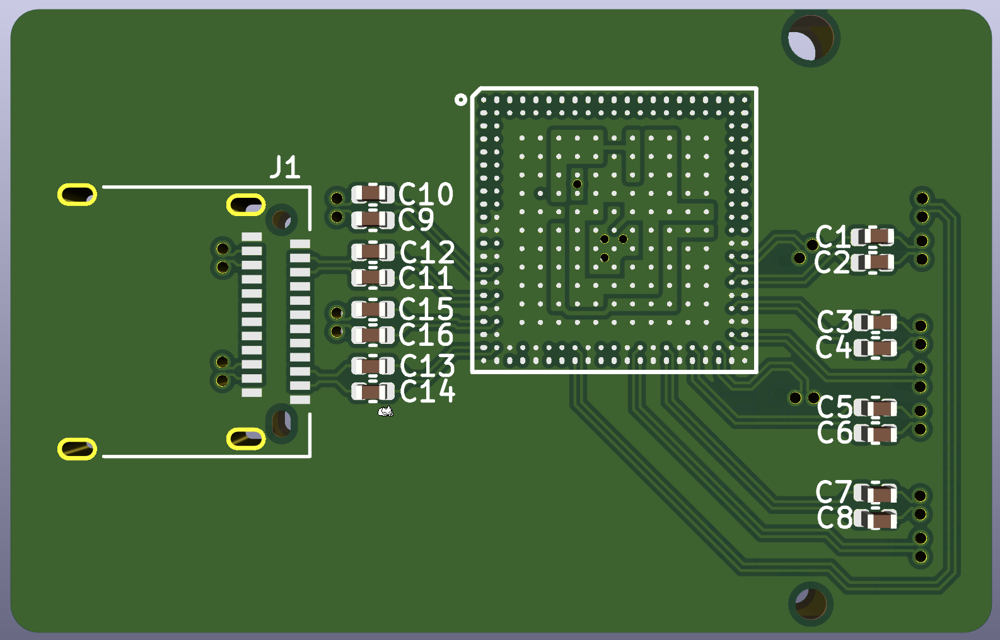

# ASM2464PD-test
I wanted to know more about the new Asmedia USB4 chips because I want to make USB-C PCIe stuff.

The ASM2464PD is meant for USB4 (or Thunderbolt 3 and USB3.x too, afaik) to NVMe SSD enclosures, and the ASM2464PDX is meant for USB4/TB to general PCIe devices such as GPUs.  
I've read that the PD one also works for general PCIe devices but it's not officially supported.

So anyway I found some sussy data online and made a kicad version of the ASM2464PD pcb footprint and schematic symbol, it's a start to figuring out how to DIY something with these chips. No datasheet tho :/  
Maybe it's useful for someone

Current PCB layout is only for fun, differential pairs are not impedance matched yet and there's probably various other issues lol. I don't even know what kind of power rails this thing needs. Definitely didn't try to clone the board from the reddit link below 💀

Random Chinese forum link with datasheet screenshots + bits of a reference schematic: https://blog.csdn.net/weixin_54493972/article/details/127628081

Footprint/symbol reference: https://jlcpcb.com/partdetail/Asmedia-ASM2464PD/C7509569

Detailed images of a board: https://www.reddit.com/r/UsbCHardware/comments/17tjmh4/diy_ultra_compact_usb4thunderbolt_4_ssd_enclosure/